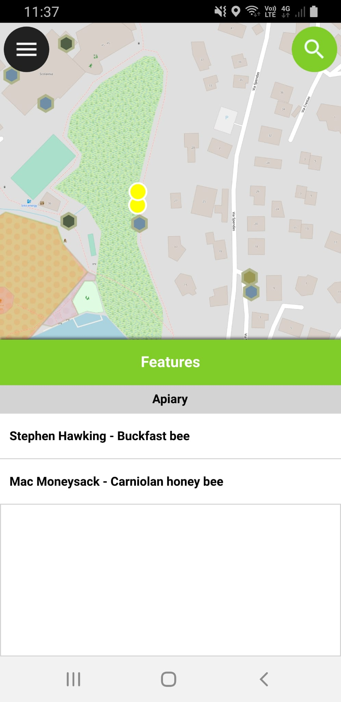

# Display expression

You have any text you want appear as description of a clicked feature.
In the example below, you can see we used the beekeeper and the bee species.

<figure>
    
</figure>

## Layer properties

To edit the display expression, go to "layer Properties" => "Display".

<figure>
    
</figure>

The expression used will be what we see when we click on features.
